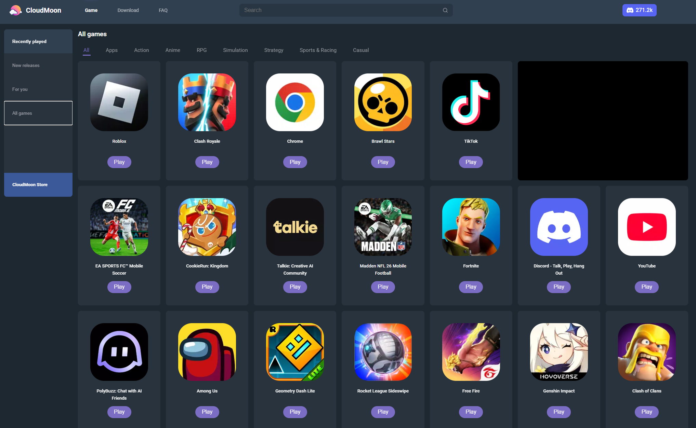

<p style="text-align: center;">#Cloudmoon InPlay.</p>




# CloudMoon InPlay

Cloudmoon InPlay is a simple site that proxies, hides, and loads cloudmoon in a browser using Cloudflare workers, allowing you to effortlessly play Roblox, Fortnight, Call of Duty Mobile, Delta Force, and More in Browser at school or work!

> [!NOTE]
> If you fork or use this repository, Please consider sharing or giving us a Star!

## Deploy

[](https://deploy.workers.cloudflare.com/?url=https://github.com/sriail/Cloudmoon-InPlay)

## Use

> [!IMPORTANT]
> Because of google's authentication policies, the google sign in button will NOT WORK. You must hit sign in with email and password instead. You will also need to register your cloudmoon account at home with google and set a password in settings befor using elsewhere (Google Sign In button is now visably hidden).

Once you sign in, you can click and play games or apps in Cloudmoons library!
After that, you can use the Controll bar for navigation, and go home using the home button, as well as fullscreening in game removing ads!


> [!NOTE]
> When Cloudmoon tries to open a new Tab, it will open in the central iframe to avoid being blocked, keeping everything self contained.

## Deploy

To deploy your owen Cloudmoon InPlay Cloudflare worker, click the deploy to Cloudflare button, and then play through the workers prevew! However, for maxamum security, it is recomended that it is embeded into another site using this code (blocks extentions with restrictive content policies by adding extra DOM Layers, which is not required, but works in the base link is blocked!) Be shure to chage 
``` src="Worker" ``` With your Worker (example URl Patter, Not real deployment : https://milefalencentfog47a.johndoe.workers.dev , with the layout https:// (random or set worker name). (email) .workers.dev )

```html
<!DOCTYPE html>
<html lang="en">
  <head>
    <meta charset="UTF-8" />
    <title>Cloudmoon InPlay</title>
    <style>
      /* Ensure the container takes up the full viewport */
      html,
      body {
        margin: 0;
        padding: 0;
        height: 100%;
        overflow: hidden;
      }
      full-page-frame {
        display: block;
        width: 100%;
        height: 100%;
      }
    </style>
  </head>
  <body>
    <!-- Custom element that will hold the triple Shadow DOM -->
    <full-page-frame
      src="Worker"  <!-- Replace with your own proxy / Cloudflare Worker -->
    ></full-page-frame>
    <script>
      class FullPageFrame extends HTMLElement {
        connectedCallback() {
          // Layer 1: First Shadow DOM
          const shadow1 = this.attachShadow({ mode: "closed" });
          
          // Create first layer container
          const layer1Container = document.createElement("div");
          layer1Container.setAttribute("id", "layer1");
          
          const style1 = document.createElement("style");
          style1.textContent = `
            #layer1 {
              width: 100%;
              height: 100%;
              display: block;
            }
          `;
          
          shadow1.appendChild(style1);
          shadow1.appendChild(layer1Container);
          
          // Layer 2: Second Shadow DOM (nested)
          const shadow2 = layer1Container.attachShadow({ mode: "closed" });
          
          const layer2Container = document.createElement("div");
          layer2Container.setAttribute("id", "layer2");
          
          const style2 = document.createElement("style");
          style2.textContent = `
            #layer2 {
              width: 100%;
              height: 100%;
              display: block;
            }
          `;
          
          shadow2.appendChild(style2);
          shadow2.appendChild(layer2Container);
          
          // Layer 3: Third Shadow DOM (nested)
          const shadow3 = layer2Container.attachShadow({ mode: "closed" });
          
          const layer3Container = document.createElement("div");
          layer3Container.setAttribute("id", "layer3");
          
          const style3 = document.createElement("style");
          style3.textContent = `
            #layer3 {
              width: 100%;
              height: 100%;
              display: block;
            }
            iframe {
              width: 100%;
              height: 100%;
              border: none;
              display: block;
            }
          `;
          
          shadow3.appendChild(style3);
          shadow3.appendChild(layer3Container);
          
          // Final iframe in the innermost layer
          const iframe = document.createElement("iframe");
          iframe.src = this.getAttribute("src");
          
          // Additional security attributes
          iframe.setAttribute("sandbox", "allow-scripts allow-same-origin allow-forms allow-popups allow-popups-to-escape-sandbox");
          iframe.setAttribute("referrerpolicy", "no-referrer");
          
          layer3Container.appendChild(iframe);
          
          // Optional: Add random attributes to obfuscate structure
          this.setAttribute("data-component", this.generateRandomId());
          layer1Container.setAttribute("data-layer", this.generateRandomId());
          layer2Container.setAttribute("data-layer", this.generateRandomId());
          layer3Container.setAttribute("data-layer", this.generateRandomId());
        }
        
        generateRandomId() {
          return Math.random().toString(36).substring(2, 15);
        }
      }
      
      // Register the custom element
      customElements.define("full-page-frame", FullPageFrame);
    </script>
  </body>
</html>
```

